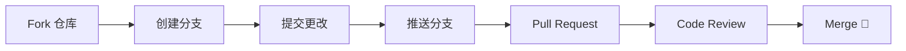

<div align="center">

# 🤖 AgentLearn

> **AI Agent 从零开始构建智能体 — 全面、系统的开源学习教程**

<p align="center">
  <a href="https://gitcode.com/mininote/AgentLearn">
    
  </a>
  <a href="https://python.org">
    
  </a>
  <a href="https://python.langchain.com">
    
  </a>
  <a href="https://langchain-ai.github.io/langgraph/">
    
  </a>
  <a href="https://gitcode.com/mininote/AgentLearn/stars">
    
  </a>
  <a href="https://gitcode.com/mininote/AgentLearn">
    
  </a>
  <a href="https://agentlearn.minims.cn" target="_blank">
    
  </a>
</p>

</div>

---

## 📖 项目简介

> **打造你的第一个 AI Agent，从认知到生产，一步到位。**
>
> 🌐 **国内访问**：[https://agentlearn.minims.cn](https://agentlearn.minims.cn)

AgentLearn 是当前最系统的开源 AI Agent 教程之一，专为 **2026 年技术栈** 打造。无论你是 AI 新手还是资深后端开发者，都可以在这里找到适合自己的成长路径。

🔹 **你将从「是什么」开始**：理解 Agent、Chain、Tool、Memory、RAG 的核心概念  
🔹 **接着「动手做」**：基于 LangChain + LangGraph 搭建真实可运行的 Agent 应用  
🔹 **最终「上生产」**：掌握多 Agent 协作、性能调优、安全防护与生产部署

```
🤖 AgentLearn 学习路径：
  基础概念 → LangChain 实战 → LangGraph 工作流 → RAG 系统 → 生产部署
```

本项目配套完整的 Python 包 [`agentlearn`](src/agentlearn/) 和 **10+ 个实战项目**，代码即学即用。无论你想构建聊天机器人、自动化工作流、知识库问答系统还是多智能体协作平台，这里都有现成的模板和最佳实践。

**已有 30+ 篇教程、~60 小时学习内容，全部免费开源。** 🚀

---

<table>
<tr>
<td width="50%" valign="top">

### 🎯 项目仪表盘

| 指标 | 数据 |
|:-----|:-----|
| 📚 教程章节 | **8 大章节** · 30+ 篇文档 |
| ⏱️ 总学习时长 | **~60 小时** |
| 💻 可运行示例 | **10+ 个**实战项目 |
| 📦 源代码包 | **agentlearn** v1.0.0 |
| 🐍 最低 Python | **3.10+** |
| 📝 最后更新 | 2026 年 |

</td>
<td width="50%" valign="top">

### ✨ 项目特色

| 特色 | 说明 |
|:----|:-----|
| 🎯 **从零开始** | 无需 AI 基础，手把手教学 |
| 📚 **系统全面** | 覆盖 Agent 开发全链路 |
| 💻 **实战驱动** | 每个知识点都有可运行代码示例 |
| 🛠️ **技术前沿** | LangChain + LangGraph 最新实践 |
| 📦 **工程规范** | 使用 `uv` 管理，符合生产标准 |
| 🌐 **生态全景** | 涵盖 2026 年主流框架与选型 |

</td>
</tr>
</table>

---

## 📑 目录导航

> 快速跳转至感兴趣的部分

| 章节 | 内容 | 适合人群 |
|:----|:-----|:---------|
| [🟢 入门基础](#-第一部分入门基础-01-intro) | AI Agent 概念、环境搭建、第一个 Agent | 新手 |
| [🔵 核心概念](#-第二部分核心概念-02-fundamentals) | Prompt 工程、Chain、Agent 架构、记忆 | 新手 |
| [🟠 LangChain 实战](#-第三部分langchain-实战-03-langchain) | 组件、工具调用、向量存储、聊天 Agent | 进阶 |
| [🟣 LangGraph 进阶](#-第四部分langgraph-进阶-04-langgraph) | 状态管理、路由、子图、工作流 | 进阶 |
| [🟤 RAG 系统](#-第五部分rag-系统-05-rag) | 文档处理、向量数据库、企业知识库 | 进阶 |
| [🔴 高级主题](#-第六部分高级主题-06-advanced) | 多 Agent、评估、成本控制、安全 | 高级 |
| [⚫ 生产部署](#-第七部分生产部署-07-deployment) | API 封装、Docker、监控、CI/CD | 高级 |
| [🌟 生态全景](#-第八部分生态全景-08-ecosystem) | 框架对比、多智能体、工具生态、选型 | 所有 |

---

## 🎯 学习目标

完成本教程后，你将能够：

<div>

| # | 技能 | 对应章节 |
|:-|:-----|:---------|
| ✅ | 理解 AI Agent 的核心概念与工作原理 | 第一部分 |
| ✅ | 熟练使用 LangChain 构建基础 Agent | 第二、三部分 |
| ✅ | 掌握 LangGraph 设计复杂工作流 | 第四部分 |
| ✅ | 实现 RAG 系统，让 Agent 拥有知识库 | 第五部分 |
| ✅ | 构建多 Agent 协作系统 | 第六部分 |
| ✅ | 将 Agent 部署到生产环境 | 第七部分 |
| ✅ | 了解 2026 年 AI Agent 全生态，做出最优选型 | 第八部分 |

</div>

---

## 📚 内容大纲

### 🟢 第一部分：入门基础 (01-intro)

> 适合零基础入门，了解 AI Agent 是什么，搭建开发环境，运行第一个 Agent。

| 章节 | 内容 | 预计时间 |
|:----|:-----|:---------|
| 1.1 | [AI Agent 导论](docs/01-intro/01-agent-intro.md) | 2 小时 |
| 1.2 | [开发环境搭建](docs/01-intro/02-environment-setup.md) | 1 小时 |
| 1.3 | [第一个 Agent](docs/01-intro/03-first-agent.md) | 1 小时 |

### 🔵 第二部分：核心概念 (02-fundamentals)

> 深入理解 LLM、Prompt 工程、Chain 模式、Agent 架构和记忆机制。

| 章节 | 内容 | 预计时间 |
|:----|:-----|:---------|
| 2.1 | [LLM 基础与 Prompt 工程](docs/02-fundamentals/01-prompt-engineering.md) | 3 小时 |
| 2.2 | [Chain 模式详解](docs/02-fundamentals/02-chain-pattern.md) | 2 小时 |
| 2.3 | [Agent 核心架构](docs/02-fundamentals/03-agent-architecture.md) | 3 小时 |
| 2.4 | [记忆机制](docs/02-fundamentals/04-memory.md) | 2 小时 |

### 🟠 第三部分：LangChain 实战 (03-langchain)

> 掌握 LangChain 核心组件，实现工具调用、向量存储和聊天 Agent。

| 章节 | 内容 | 预计时间 |
|:----|:-----|:---------|
| 3.1 | [LangChain 核心组件](docs/03-langchain/01-core-components.md) | 2 小时 |
| 3.2 | [工具调用 (Tool Use)](docs/03-langchain/02-tool-use.md) | 3 小时 |
| 3.3 | [向量存储与检索](docs/03-langchain/03-vector-store.md) | 3 小时 |
| 3.4 | [构建聊天 Agent](docs/03-langchain/04-chat-agent.md) | 2 小时 |
| 3.5 | [实战：研究助手](docs/03-langchain/05-research-agent.md) | 4 小时 |

### 🟣 第四部分：LangGraph 进阶 (04-langgraph)

> 学习 LangGraph 工作流引擎，掌握状态管理、条件路由和子图。

| 章节 | 内容 | 预计时间 |
|:----|:-----|:---------|
| 4.1 | [LangGraph 基础](docs/04-langgraph/01-basics.md) | 2 小时 |
| 4.2 | [状态管理与节点](docs/04-langgraph/02-state-nodes.md) | 2 小时 |
| 4.3 | [条件路由与循环](docs/04-langgraph/03-routing-loops.md) | 3 小时 |
| 4.4 | [子图与模块化](docs/04-langgraph/04-subgraphs.md) | 2 小时 |
| 4.5 | [实战：工作流 Agent](docs/04-langgraph/05-workflow-agent.md) | 4 小时 |

### 🟤 第五部分：RAG 系统 (05-rag)

> 构建检索增强生成系统，让 Agent 拥有外部知识库。

| 章节 | 内容 | 预计时间 |
|:----|:-----|:---------|
| 5.1 | [RAG 原理详解](docs/05-rag/01-principles.md) | 2 小时 |
| 5.2 | [文档处理与分块](docs/05-rag/02-document-processing.md) | 2 小时 |
| 5.3 | [向量数据库实战](docs/05-rag/03-vector-database.md) | 3 小时 |
| 5.4 | [检索优化技巧](docs/05-rag/04-optimization.md) | 2 小时 |
| 5.5 | [实战：企业知识库](docs/05-rag/05-enterprise-kb.md) | 4 小时 |

### 🔴 第六部分：高级主题 (06-advanced)

> 探索多 Agent 协作、评估优化、成本控制和安全合规。

| 章节 | 内容 | 预计时间 |
|:----|:-----|:---------|
| 6.1 | [多 Agent 协作](docs/06-advanced/01-multi-agent.md) | 3 小时 |
| 6.2 | [Agent 评估与优化](docs/06-advanced/02-evaluation.md) | 2 小时 |
| 6.3 | [成本控制策略](docs/06-advanced/03-cost-control.md) | 2 小时 |
| 6.4 | [安全与合规](docs/06-advanced/04-security.md) | 2 小时 |

### ⚫ 第七部分：生产部署 (07-deployment)

> 将 Agent 应用部署到生产环境，实现容器化、监控和持续集成。

| 章节 | 内容 | 预计时间 |
|:----|:-----|:---------|
| 7.1 | [API 服务封装](docs/07-deployment/01-api-service.md) | 2 小时 |
| 7.2 | [Docker 容器化](docs/07-deployment/02-docker.md) | 2 小时 |
| 7.3 | [监控与日志](docs/07-deployment/03-monitoring.md) | 2 小时 |
| 7.4 | [持续集成/部署](docs/07-deployment/04-cicd.md) | 2 小时 |

### 🌟 第八部分：生态全景 (08-ecosystem)

> 俯瞰 2026 年 AI Agent 全生态，从框架对比到领域实践，做出最优选型。

| 章节 | 内容 | 预计时间 |
|:----|:-----|:---------|
| 8.1 | [核心 Agent 框架全景对比](docs/08-ecosystem/survey/01-core-frameworks.md) | 2 小时 |
| 8.2 | [多智能体协作模式深度解析](docs/08-ecosystem/survey/02-multi-agent-patterns.md) | 2 小时 |
| 8.3 | [工具调用与编排生态](docs/08-ecosystem/survey/03-tool-ecosystem.md) | 1.5 小时 |
| 8.4 | [记忆系统全景](docs/08-ecosystem/survey/04-memory-systems.md) | 1.5 小时 |
| 8.5 | [低代码/可视化 Agent 平台](docs/08-ecosystem/survey/05-low-code-platforms.md) | 1.5 小时 |
| 8.6 | [专业领域 Agent](docs/08-ecosystem/survey/06-domain-agents.md) | 2 小时 |
| 8.7 | [评估与监控工具](docs/08-ecosystem/survey/07-evaluation-tools.md) | 1.5 小时 |
| 8.8 | [安全与沙箱](docs/08-ecosystem/survey/08-security-sandbox.md) | 1.5 小时 |
| 8.9 | [选型指南与决策矩阵](docs/08-ecosystem/survey/09-selection-guide.md) | 2 小时 |
| 📦 **HiClaw 实践** | [HiClaw 教程](docs/08-ecosystem/hiclaw/README.md) — Kubernetes 原生多 Agent 编排系统 | 专题 |

---

## 🚀 快速开始

### 前置要求

| 要求 | 说明 |
|:----|:-----|
| 🐍 Python | **3.10+** |
| 📦 包管理器 | **uv** >= 0.5.0 |
| 🔑 API Key | **OpenAI** 或其他 LLM API |

### 📥 安装 uv

<details>
<summary>点击展开安装命令</summary>

```bash
# macOS / Linux
curl -LsSf https://astral.sh/uv/install.sh | sh

# Windows
powershell -c "irm https://astral.sh/uv/install.ps1 | iex"

# 验证安装
uv --version
```

</details>

### 🛠️ 克隆 & 安装

```bash
# 克隆仓库
git clone https://gitcode.com/mininote/AgentLearn.git
cd AgentLearn

# 安装依赖（自动创建虚拟环境）
uv sync
```

### 🔑 配置环境变量

```bash
# 复制环境变量模板
cp .env.example .env

# 编辑 .env 文件，填入你的 API Key
# OPENAI_API_KEY=sk-xxxxxxxxxxxxxxxxxxxx
```

### 🎮 运行示例

```bash
# 🖐️ 第一个 Agent — 最简单的 Hello World
python examples/01-hello-agent/main.py

# 🧪 研究助手 — 多工具协作
python examples/04-research-agent/main.py

# 💬 Streamlit 聊天界面 — 交互式对话
streamlit run examples/05-streamlit-chat/main.py
```

---

## 📁 项目结构

<details>
<summary><b>展开查看完整目录结构</b></summary>

```
AgentLearn/
├── 📄 项目配置
│   ├── README.md                    # 项目说明（你在这里）
│   ├── LICENSE                      # MIT 许可证
│   ├── pyproject.toml               # 项目配置 (uv)
│   ├── uv.lock                      # 依赖锁定文件
│   ├── .env.example                 # 环境变量模板
│   └── .gitignore
│
├── 📚 教程文档 (docs/)
│   ├── 01-intro/               # 🟢 入门基础 (3 篇)
│   ├── 02-fundamentals/        # 🔵 核心概念 (4 篇)
│   ├── 03-langchain/           # 🟠 LangChain 实战 (5 篇)
│   ├── 04-langgraph/           # 🟣 LangGraph 进阶 (5 篇)
│   ├── 05-rag/                 # 🟤 RAG 系统 (5 篇)
│   ├── 06-advanced/            # 🔴 高级主题 (4 篇)
│   ├── 07-deployment/          # ⚫ 生产部署 (4 篇)
│   └── 08-ecosystem/           # 🌟 生态全景 (9 篇)
│
├── 💻 代码示例 (examples/)
│   ├── 01-hello-agent/         # 🖐️ 第一个 Agent
│   ├── 02-tool-use/            # 🔧 工具调用
│   ├── 03-chat-agent/          # 💬 聊天 Agent
│   ├── 04-research-agent/      # 🔬 研究助手
│   ├── 05-streamlit-chat/      # 🎨 Streamlit 聊天界面
│   ├── 06-multi-agent/         # 👥 多 Agent 协作
│
├── 📦 核心库 (src/agentlearn/)
│   ├── base.py                  # 基础类
│   ├── agent.py                 # Agent 实现
│   ├── tools.py                 # 工具集合
│   ├── memory.py                # 记忆管理
│   ├── message.py               # 消息模型
│   ├── pipeline.py              # 流水线编排
│   └── utils.py                 # 工具函数
│
├── 🧪 测试 (tests/)
│   ├── test_agent.py
│   └── test_tools.py
│
└── 🔧 辅助脚本 (scripts/)
    ├── setup.sh                 # 环境设置
    └── deploy.sh                # 部署脚本
```

</details>

---

## 🛠️ 技术栈

| 类别 | 技术 | 版本 |
|:----|:-----|:-----|
| 📦 **包管理** | [uv](https://docs.astral.sh/uv/) | >= 0.5.0 |
| 🐍 **语言** | [Python](https://python.org) | >= 3.10 |
| 🧠 **核心框架** | [LangChain](https://python.langchain.com/) | >= 1.3.1 |
| 🔄 **工作流** | [LangGraph](https://langchain-ai.github.io/langgraph/) | >= 1.2.1 |
| 🗄️ **向量数据库** | Chroma / FAISS / Qdrant | >= 1.5.0 |
| 🤖 **LLM** | OpenAI GPT-4o / Anthropic Claude 3.5 / DeepSeek | - |
| 🐳 **部署** | Docker / FastAPI / Streamlit | - |
| ✅ **代码质量** | Black + Ruff + Mypy + Pytest | - |

---

## 📈 学习路线图

<p>

```
┌─────────────────────────────────────────────────────────────┐
│                  8 周完整学习路线 🗺️                         │
├─────────────────────────────────────────────────────────────┤
│  Week 1-2: 🟢 入门基础                                       │
│  ├── 理解 AI Agent 概念                                       │
│  ├── 搭建开发环境                                             │
│  └── 运行第一个 Agent 🖐️                                     │
├─────────────────────────────────────────────────────────────┤
│  Week 3-4: 🔵🟠 核心技能                                      │
│  ├── 掌握 LangChain 核心组件                                  │
│  ├── 精通 Prompt 工程                                        │
│  ├── 实现工具调用与记忆                                       │
│  └── 构建聊天 Agent 💬                                       │
├─────────────────────────────────────────────────────────────┤
│  Week 5-6: 🟣🟤 进阶实战                                      │
│  ├── 学习 LangGraph 工作流                                    │
│  ├── 构建 RAG 知识库系统                                      │
│  └── 多 Agent 协作实战 👥                                    │
├─────────────────────────────────────────────────────────────┤
│  Week 7-8: ⚫🌟 生产部署 + 生态全景                             │
│  ├── API 封装与 Docker 部署 🐳                                │
│  ├── 了解全生态框架与选型                                      │
│  ├── 监控、评估与安全 ⚡                                      │
│  └── 完成最终项目 🏆                                         │
└─────────────────────────────────────────────────────────────┘

```

</p>

---

## 🤝 贡献指南

我们欢迎任何形式的贡献！无论是修复错别字、改进文档，还是添加新功能。

### 🏗️ 工作流程



### 📐 代码规范

| 规范 | 要求 |
|:----|:-----|
| 📦 **依赖管理** | 使用 `uv`，不可用 pip |
| ✨ **代码风格** | 遵循 PEP 8，使用 Black 格式化 |
| 📝 **文档** | 函数/类添加类型注解和文档字符串 |
| 🧪 **测试** | 新功能必须包含单元测试 |
| 🔍 **类型检查** | 通过 Mypy strict 模式 |

---

## 📄 许可证

[](https://opensource.org/licenses/MIT)

本项目采用 **MIT License** — 详见 [LICENSE](LICENSE) 文件

**你可以自由地：** ✅ 使用 · ✅ 修改 · ✅ 分发 · ✅ 商用

---

## 🔗 相关资源

<div>

| 🧠 核心框架 | 🌐 平台工具 | 📖 学习资料 |
|:-----------|:-----------|:-----------|
| [LangChain](https://python.langchain.com/) | [Dify](https://dify.ai/) | [LangChain 官方教程](https://python.langchain.com/docs/tutorials/) |
| [LangGraph](https://langchain-ai.github.io/langgraph/) | [AgentScope](https://agentscope.io/) | [LangGraph 官方指南](https://langchain-ai.github.io/langgraph/tutorials/) |
| [AutoGen](https://microsoft.github.io/autogen/) | [Flowise](https://flowiseai.com/) | [OpenAI Cookbook](https://cookbook.openai.com/) |
| [CrewAI](https://docs.crewai.com/) | [LangSmith](https://smith.langchain.com/) | [DeepLearning.AI](https://www.deeplearning.ai/short-courses/) |

</div>

---

## ⭐ 支持项目

如果你觉得这个项目有帮助，请给我们一个 ⭐ 支持！

<div>

| [](https://gitcode.com/mininote/AgentLearn) | [](https://gitcode.com/mininote/AgentLearn) | [](https://gitcode.com/mininote/AgentLearn/issues) |
|:-|:-|:-|

</div>

---

### 🙏 致谢

感谢以下出色的开源项目，以及所有贡献者和社区成员的支持：

| 项目 | 用途 | 链接 |
|:----|:----|:-----|
| [LangChain](https://github.com/langchain-ai/langchain) | 核心 Agent 框架 | ⭐ 100k+ |
| [LangGraph](https://github.com/langchain-ai/langgraph) | 工作流编排 | ⭐ 15k+ |
| [AutoGen](https://github.com/microsoft/autogen) | 多 Agent 框架 | ⭐ 40k+ |
| [CrewAI](https://github.com/joaomdmoura/crewAI) | 多 Agent 协作 | ⭐ 30k+ |
| [AgentScope](https://github.com/alibaba/agentscope) | 分布式 Agent | ⭐ 10k+ |
| [Dify](https://github.com/langgenius/dify) | LLMOps 平台 | ⭐ 60k+ |
| [uv](https://github.com/astral-sh/uv) | Python 包管理 | ⭐ 40k+ |

---

> ### 🚀 让 AI Agent 成为你的超级助手，开启智能开发新纪元！
>
> **有问题？** 欢迎提交 [Issue](https://gitcode.com/mininote/AgentLearn/issues) 或参与社区讨论 💬
